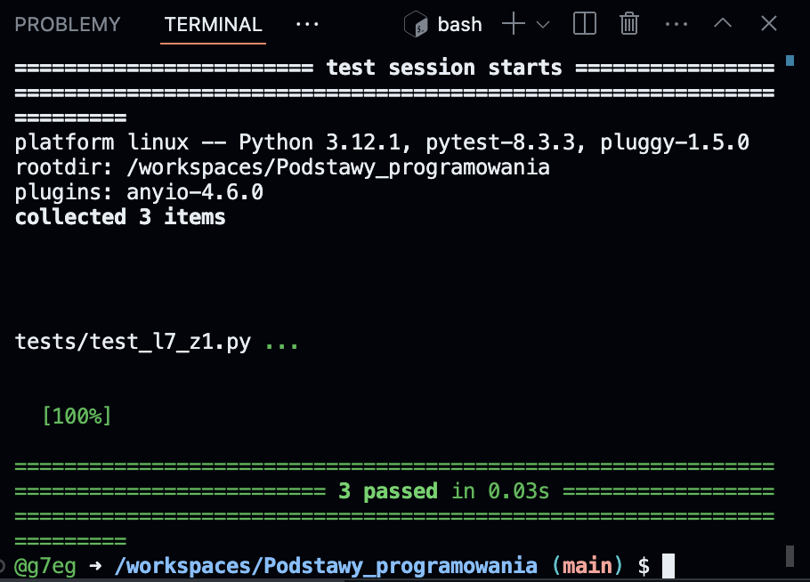
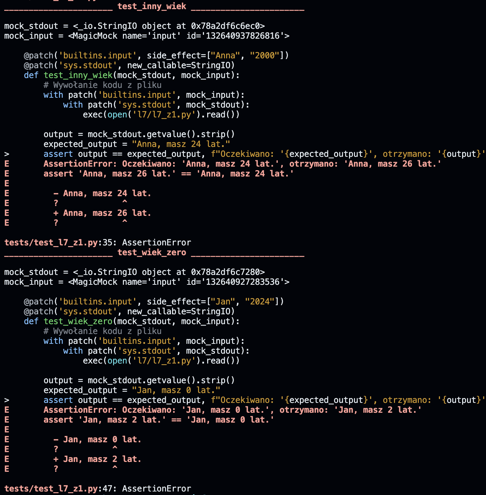
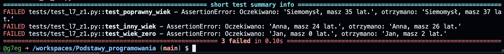

# Podstawy programowania

Podstawy programowania.

---

<details>
<summary>Jak zalogować się do Codespace:</summary>

Jak zalogować się do Codespace:<br>

1. :mailbox: Załóż konto na GitHub korzystając z maila studenckiego.<br>
2. :link: Dołącz do Classroom klikając w link udostępniony przez prowadzącego.<br>
3. :key: Zaloguj się na swoje konto GitHub.<br>
4. :running: Uruchomm Codespace.

</details>
<br>

<details>
<summary>Jak sprawdzić swój program czy został wykonany poprawnie?</summary>
<br>
Do kazdego programu zostały utworzone po minimum 3 testy jednostkowe.
Testy jednostkowe to nic innego jak sprypty sprawdzające czy dany program działa poprawnie.
Są szeroko wykorzysytwane w wielu projektach deweloperskich.
<br>W tym kursie nie skupiamy się na programowaniu takich testów więc będziemy z nich jedynie korzystać w celu sprawdzania poprawności wykonania zadania.<br>
<br>

1. :hammer: Rozwiąz zadanie zgodnie z treścią polecenia.<br>
2. :pushpin: Samodzielnie ręcznie (uruchamiając go) przetestuj czy program wykonuje treść polecenia w taki sam sposób jak podano w przykładzie. Wielkość liter i formatowanie w wyświelnanych komunikatach ma znaczenie.<br>
3. :pizza: Uruchom test jednostkowy wykonując następujące polecenie w terminalu:<br>
   1. ```pytest tests/test_l$_z#.py```
   Gdzie $ to numer listy a # to numer zadania 
   np.:```pytest tests/test_l7_z1.py```
   > [!TIP]
   > Podczas wpisywania polecenia mozesz korzsytać z tabulatora (klawisz TAB) w celu podpowiadania nazw plików i scieki do katalogów. Przyśpieszy to pisanie polecenia i zminimalizuje ryzyko powstania błedu. Jezeli dana podowiedz nie jest tym czego oczekujesz, wystarczy ponownie wcisnąć klawisz TAB. Przkładowo:
   Mozesz wpisać "pytest te" tu nacisnąć TAB i podopowie Ci "pytest tests/" poniewaz tylko taki katalog znajduje się w katalogu głównym. Następnie dopisz "pytest tests/te" i znów wciśnij TAB. Program podpowie Ci kolejny fragment "pytest tests/test_l" i tu juz musisz podac numer listy, a następnie mozesz znów uzyć TAB. Poćwicz to podczas pisania poleceń.

4. :running: Test jednostkowy dla wybranego zadanie zostanie uruchomiony.
   1. Jezeli wszystko jest wykonane poprawnie. Otrzymasz na zielono komunikat ze program przeszedł testy '3 passed in 0.03s' 
   2. Jezeli napisany przez Ciebie program nie spłenia kryterium w terminalu zostanie wyświetlony obszerny komunikat o miejscach potencjalnego błędu. Analiza tego raportu powinna pozwlolić Ci zrozumieć na czym polega błąd. Zazwyczaj wystarczy przeanalizować obszar raportu którzy jest wyświetlony kolorem czerwonym. Na screenie ponizej przykład AssertionError, czyli takiej zgodności pomiędzy tym co test jednostkowy oczekuje ze otrzyma a tym co otrzymał. Więcej o pojęciu assercji mozna znaleźć tutaj: [Wikipedia - Asercja](https://pl.wikipedia.org/wiki/Asercja_(informatyka)). Teraz musisz wyciągnąć wnioski i poprawić swój program. 
   3. Aby ułatwić Ci zrozumienie napotkanego problememu na końcu raportu znajduje się sekcja ___'short test summary info'___. Gdzie w duzym skrócie opisane jest co oczekiwano a co otrzymano z uruchomienia Twojego programu w trakcie testu. W przykładznie ponizej problem jest z obliczaniem poprawnego wieku. !
   4. Po dokonaniu poprawek mozesz raz jeszcze uruchomić test. Mozesz uzyć strzałek góra/dół do przewinięcia polecenia które niedawno wykorzystywałeś - przyśpieszy to wprowadzanie polecenia w terminalu.

</details>
<br>

> [!NOTE]
> Codespace pozwala pracować w prekonfigurowanym środowisku z poziomu przeglądarki internetowej. Nie musisz instalować żadnego środowiska lokalnie na komputerze. Wystarczy że zalogujesz się na swoje konto.

### LISTY ZADAŃ:

> [!NOTE]
> :book: Treść zadań dla poszczególnych list znajduje się w rozwijanym menu poniżej. Polecenie możesz też znaleźć w plikach .py znajdujących się w Codespace. Jeżeli treść polecenia poniżej różni się od tej w pliku, przyjmij że treść polecenia w pliku jest tą właściwą. Fakt ten zgłość również prowadzacemu :gem:

<details>
<summary> Treść zadań lista 7 </summary>

# Lista 7 :guitar:

## Lista 7 Zad. 1

### 1pkt

Napisać program proszący użytkownika o imię i rok urodzenia, a następnie obliczający i wypisujący jego
wiek.

> [!TIP]
> Przykład:
> Podaj swoje imię:
> Siemomysł
> Podaj rok urodzenia:
> 1989
> Siemomysł, masz 33 lata.

---

## Lista 7 Zad. 2

### 2pkt

Napisać program proszący użytkownika o podanie dwóch liczb a i b i wypisujący ich sumę, różnicę,
iloczyn, iloraz, √(𝑎 + 𝑏) oraz ab i ba. W przypadku dzielenia przez 0 lub a+b < 0 zwróć wynik jak0 'undefined'.

> [!TIP]
> Przykład:
> Podaj liczbę a: 5
> Podaj liczbę b: 0
> Suma: 5.0
> Różnica: 5.0
> Iloczyn: 0.0
> Iloraz: undefined
> Pierwiastek z (a + b): 2.23606797749979
> a do potęgi b: 1.0
> b do potęgi a: 0.0

---

## Lista 7 Zad. 3

### 2pkt

Napisać program, który oblicza pole i obwód koła o promieniu podanym przez użytkownika. Promień
nie może być ujemny. W przypadku podania liczby ujemnej, program powinien wypisywać komunikat "Błąd: Promień nie może być ujemny." informujący o błędnej wartości i nic nie liczyć.

> [!TIP]
> Przykład:
> Podaj promień koła: 12
> Pole koła: 452.3893421169302
> Obwód koła: 75.39822368615503

> [!TIP]
> Przykład:
> Podaj promień koła: -12
> Błąd: Promień nie może być ujemny.

---

## Lista 7 Zad. 4

### 2pkt

Napisać program proszący użytkownika o podanie dwóch liczb a i b. Następnie należy wyświetlić, która
z tych liczb jest większa, bądź komunikat, że są sobie równe.

> [!TIP]
> Przykład:
> Podaj pierwszą liczbę (a): 2
> Podaj drugą liczbę (b): 2
> Liczby są sobie równe.

> [!TIP]
> Przykład:
> Podaj pierwszą liczbę (a): -2
> Podaj drugą liczbę (b): 2
> Liczba 2.0 jest większa od -2.0.

---

## Lista 7 Zad. 5

### 2pkt

Napisać program sprawdzający czy osoba urodzona w danym roku jest pełnoletnia

> [!TIP]
> Przykład:
> Podaj swoje imię: Marian
> Podaj rok urodzenia: 1833
> Marian, masz 191 lat, jesteś pełnoletni.

---

## Lista 7 Zad. 6

### 2pkt

Napisać program, który sprawdzi czy podana liczba jest parzysta i wyświetli odpowiedni komunikat.

> [!TIP]
> Przykład:
> Podaj liczbę: 34
> Liczba 34 jest parzysta.

> [!TIP]
> Przykład:
> Podaj liczbę: -123
> Liczba -123 jest nieparzysta.

---

## Lista 7 Zad. 7

### 2pkt

Napisać program, który sprawdzi czy z podanych długości można stworzyć trójkąt i wypisze odpowiedni
komunikat.

> [!TIP]
> Przykład:
> Podaj długość pierwszego boku: 1
> Podaj długość drugiego boku: 2
> Podaj długość trzeciego boku: 3
> Nie można stworzyć trójkąta.

> [!TIP]
> Przykład:
> Podaj długość pierwszego boku: 3
> Podaj długość drugiego boku: 4
> Podaj długość trzeciego boku: 5
> Można stworzyć trójkąt.

---

## Lista 7 Zad. 8

### 3pkt

Napisać program, który pobierze od studenta liczbę punktów i oceni go według podanej skali. Ponadto
użytkownik może wybrać w jakiej formie chce dostać ocenę (liczbowo lub słownie lub oba). W przypadku podania błędnej formy wypisz kompunikat: 'Nieznana forma oceny.'
Skala:
<0; 50) 2.0 (niedostateczny)
<50;60) 3.0 (dostateczny)
<60;70) 3.5 (dostateczny plus)
<70;80) 4.0 (dobry)
<80;90) 4.5 (dobry plus)
<90;100) 5.0 (bardzo dobry)
<100> 5.5 (celujący)

> [!TIP]
> Przykład:
> Podaj liczbę punktów: 66
> Wybierz formę oceny (liczbowo, słownie, oba): liczbowo
> Otrzymałeś ocenę: 3.5

> [!TIP]
> Przykład:
> Podaj liczbę punktów: 99
> Wybierz formę oceny (liczbowo, słownie, oba): oba
> Otrzymałeś ocenę: 5.0 (bardzo dobry)

</details>

<details>
<summary> Treść zadań lista 8 </summary>

# Lista 8 :crown:

---

## Lista 8 Zad. 1

### 2pkt

Napisać program, który dla wprowadzonego przez użytkownika ciągu liczb rzeczywistych wyznacza ich
średnią arytmetyczną. Wprowadzanie ciągu kończy się poprzez wprowadzenie napisu ’end’. Program
powinien raportować błąd, jeśli ’end’ jest pierwszą podaną wartością.

> [!TIP]
> Przykład:
> Podaj liczbę (lub 'end' aby zakończyć): 1
> Podaj liczbę (lub 'end' aby zakończyć): -22
> Podaj liczbę (lub 'end' aby zakończyć): 8
> Podaj liczbę (lub 'end' aby zakończyć): -3.5
> Podaj liczbę (lub 'end' aby zakończyć): 13
> Podaj liczbę (lub 'end' aby zakończyć): end
> Średnia arytmetyczna wynosi: -0.7

---

## Lista 8 Zad. 2

### 1pkt

Napisać program wyświetlający liczby całkowite z przedziału <0,y> (liczbę całkowitą y podaje użytkownik). W przypadku podania niewłaściwej wartości wyświetl komunikat: "Błąd: Liczba y musi być większa lub równa 0."

> [!TIP]
> Przykład:
> Podaj liczbę całkowitą y: 2
> 0
> 1
> 2

> [!TIP]
> Przykład:
> Podaj liczbę całkowitą y: -2
> Błąd: Liczba y musi być większa lub równa 0.

---

## Lista 8 Zad.3

### 2pkt

Napisać program wyświetlający liczby całkowite z przedziału <x,y> (liczby całkowite x i y podajeużytkownik). W przypadku podania niewłaściwej wartości wyświetl komunikat: "Błąd: Liczba x musi być mniejsza lub równa liczbie y."

> [!TIP]
> Przykład:
> Podaj liczbę całkowitą x: -2
> Podaj liczbę całkowitą y: 5
> -2
> -1
> 0
> 1
> 2
> 3
> 4
> 5

> [!TIP]
> Przykład:
> Podaj liczbę całkowitą x: 4
> Podaj liczbę całkowitą y: 2
> Błąd: Liczba x musi być mniejsza lub równa liczbie y.

---

## Lista 8 Zad. 4

### 2pkt

Napisać program, który wyświetli wszystkie liczby z przedziału od 50 do 100 podzielne przez dowolną liczbę k, którą podaje użytkownik. W przypadku podania niewłaściwej wartości wyświetl komunikat: "Błąd: Liczba k musi być większa od zera."

> [!TIP]
> Przykład:
> Podaj liczbę całkowitą k: 4
> 52
> 56
> 60
> 64
> 68
> 72
> 76
> 80
> 84
> 88
> 92
> 96
> 100

> [!TIP]
> Przykład:
> Podaj liczbę całkowitą k: -2
> Błąd: Liczba k musi być większa od zera.

---

## Lista 8 Zad. 5

### 2pkt

Napisać program, gdzie zadaniem gracza jest odgadnięcie liczby. Liczba jest wprowadzona na stałe w kodzie. Jeżeli użytkownik poda za dużą liczbę program wyświetli komunikat „Szukana wartość jest mniejsza”. Jeżeli wprowadzi za małą liczbę program wyświetli „Szukana wartość jest większa”. Po odgadnięciu liczby gracz dowiaduje się po ilu próbach udało mu się zakończyć grę.

> [!TIP]
> Przykład:
> Podaj liczbę: 22
> Szukana wartość jest większa
> Podaj liczbę: 45
> Szukana wartość jest mniejsza
> Podaj liczbę: 42
> Brawo! Odgadłeś liczbę w 3 próbach.

> [!TIP]
> Przykład:
> Podaj liczbę: 42
> Brawo! Odgadłeś liczbę w 1 próbach.

---

## Lista 8 Zad. 6

### 2pkt

Napisać program, który narysuje z gwiazdek (\*) kwadrat 10 na 10.

> [!TIP]
> Przykład:

<blockquote>
**********<br>
**********<br>
**********<br>
**********<br>
**********<br>
**********<br>
**********<br>
**********<br>
**********<br>
**********<br>
</blockquote>

---

## Lista 8 Zad. 7

### 3pkt

Napisać program który wypisze na ekranie wszystkie możliwe kombinacje książek jakie można wybrać.
Do wyboru jest pięć książek, a wybieramy trzy z nich.

> [!TIP]
> Przykład:
> 1 2 3
> 1 2 4
> 1 2 5
> 1 3 4
> 1 3 5
> 1 4 5
> 2 3 4
> 2 3 5
> 2 4 5
> 3 4 5

</details>

<details>
<summary> Treść zadań lista 9 </summary>

# Lista 9 :ghost:

## Lista 9 Zad. 1

### 1pkt

Napisać program proszący użytkownika o ilość liczb, które chce wprowadzić, następnie po kolei, każdą
liczbę należy wprowadzić do listy i wypisać cała zawartość listy. W przypadku podania niepoprawnej
wartości w pierwszym pytaniu program powinien powiadomić użytkownika o błędzie.

> [!TIP]
> Przykład:
> Ile chcesz wprowadzić liczb? 3
> Podaj liczbę: 12
> Podaj liczbę: 33
> Podaj liczbę: 2
> Lista: [12, 33, 2]

---

## Lista 9 Zad. 2

### 2pkt

Korzystając z programu z zad 1 do wprowadzenia liczb, zsumować wszystkie liczby w liście i wypisać na ekran.

> [!TIP]
> Przykład:
> Ile chcesz wprowadzić liczb? 3
> Podaj liczbę: 2
> Podaj liczbę: 3
> Podaj liczbę: 5
> Lista: [2, 3, 5]
> Suma liczb: 10

---

## Lista 9 Zad. 3

### 2pkt

Korzystając z programu z zad 1 do wprowadzenia liczb, znaleźć najmniejszą i największą wartość w
liście i wypisać ją na ekran

> [!TIP]
> Przykład:
> Ile chcesz wprowadzić liczb? 4
> Podaj liczbę: 2
> Podaj liczbę: 3
> Podaj liczbę: 5
> Podaj liczbę: 6
> Lista: [2, 3, 5, 6]
> Najmniejsza wartość: 2
> Największa wartość: 6

> [!TIP]
> Przykład:
> Ile chcesz wprowadzić liczb? -2
> Błędna wartość, wprowadź liczbę większą niż 0.

---

## Lista 9 Zad. 4

### 2pkt

Korzystając z programu z zad 1 do wprowadzenia liczb, znaleźć wszystkie pary liczb, których w suma
daje liczbę podaną przez użytkownika.

> [!TIP]
> Przykład:
> Ile chcesz wprowadzić liczb? 5
> Podaj liczbę: 3
> Podaj liczbę: 4
> Podaj liczbę: 0
> Podaj liczbę: 7
> Podaj liczbę: 1
> Lista: [3, 4, 0, 7, 1]
> Wprowadź szukaną sumę: 7
> 3 + 4 = 7
> 0 + 7 = 7

> [!TIP]
> Przykład:
> Ile chcesz wprowadzić liczb? 2
> Podaj liczbę: 2
> Podaj liczbę: 3
> Lista: [2, 3]
> Wprowadź szukaną sumę: 22
> Brak par liczb, których suma jest równa szukanej sumie.

---

## Lista 9 Zad. 5

### 3pkt

Przygotować słownik zawierający min 5 kierunków studiów oferowanych na Politechnice Wrocławskiej
razem z wydziałem, na którym są oferowane. Następnie napisać program, który będzie wskazywał na
jakim wydziale znajduje się kierunek wyszukiwany przez użytkownika. W przypadku braku takiego
kierunku poinformuj użytkownika, że nie może studiować tego kierunku na Politechnice Wrocławskiej.

> [!TIP]
> Przykład:
> Podaj nazwę kierunku studiów: Informatyka
> Kierunek Informatyka znajduje się na Wydział Elektroniki.

> [!TIP]
> Przykład:
> Podaj nazwę kierunku studiów: Garncarstwo
> Nie możesz studiować kierunku Garncarstwo na Politechnice Wrocławskiej.

---

## Lista 9 Zad. 6

### 3pkt

Napisać program, który pobierze od użytkownika zdanie, a następnie policzy występowania
poszczególnych znaków w danym zdaniu (oprócz znaku spacji), umieści wynik w słowniku i wypisze go
na ekran. Zastosować metodę .lower(), aby do słownika wprowadzać tylko małe litery niezależnie od
tego jak zostały wprowadzone przez użytkownika. Litery mają być kluczem, wartością liczba wystąpień.

> [!TIP]
> Przykład:
> Podaj zdanie: Python jest SUPER!
> {'p': 2, 'y': 1, 't': 2, 'h': 1, 'o': 1, 'n': 1, 'j': 1, 'e': 2, 's': 2, 'u': 1, 'r': 1, '!': 1}

</details>

<details>
<summary> Treść zadań lista 10 </summary>

# Lista 10 :rocket:

## Lista 10 Zad. 1

### 1pkt

Napisać funkcję **_kelvin_na_celsiusz()_** która przyjmuje wartość temperatury w Kelvinach i zwraca wartość wyrażoną w
stopniach Celsjusza. W przypadku podania wartości ujemnej funkcja zwraca None.

> [!TIP]
> Przykład:
> Podaj temperaturę w Kelvinach: 223
> Temperatura w stopniach Celsjusza: -50.15

> [!TIP]
> Przykład:
> Podaj temperaturę w Kelvinach: -2
> Wartość nie może być ujemna.

## Lista 10 Zad. 2

### 2pkt

Napisać program, w którym należy sprawdzić we funkcji **_czy_liczba_doskonala(n)_**, czy podana liczba **_n_** jest liczbą doskonała. Funkcja zwraca True jeśli liczba jest liczbą doskonała lub False jeśli nią nie jest. Liczba doskonała to liczba naturalna, która jest sumą wszystkich swych naturalnych dzielników właściwych (to znaczy od niej mniejszych).

> [!TIP]
> Przykład:
> Podaj licnę którą chcesz sprawdzić:6
> Liczba 6 jest liczbą doskonałą.

> [!TIP]
> Przykład:
> Podaj licnę którą chcesz sprawdzić:12
> Liczba 12 nie jest liczbą doskonałą.

## Lista 10 Zad. 3

### 2pkt

Napisać program, w którym należy utworzysz funkcje **_czy_liczba_pierwsza(n)_** sprawdzajacą czy **_n_** jest liczbą pierwszą, zwracając True lub False. Następnie utwórzyć kolejną funkcję **_generuj_nieparzyste_liczby_pierwsze()_** wykorzystującą wcześniej utworzoną funckę **_czy_liczba_pierwsza(n)_** która za pomocą wyrażania generującego obliczy liczby pierwsze od 1 do 100.
Wynik wyświetl w postaci listy zawierającej liczby pierwsze ze wskazanego przedziału.

-   Sprawdzanie, czy liczba jest pierwsza powinno odbyć się w odrębnej funkcji.

> [!TIP]
> Przykład:
> Nieparzyste liczby pierwsze od 1 do 100:
> [3, 5, 7, 11, 13, 17, 19, 23, 29, 31, 37, 41, 43, 47, 53, 59, 61, 67, 71, 73, 79, 83, 89, 97]

## Lista 10 Zad. 4

### 2pkt

Napisać program, który będzie obliczał i zwracał silnię podanej liczby za pomocą funkcji oblicz_silnie(n). Następnie wykorzystać
funkcję obliczającą silnię do znalezienia silni dla liczby wybranej przez użytkownika.

> [!TIP]
> Przykład:
> Podaj liczbę, dla której chcesz obliczyć silnię: 3
> Silnia liczby 3 wynosi 6.

## Lista 10 Zad. 5

### 3pkt

Napisać program z wykorzystaniem funkcji, który przeprowadzi operacje dodawania, odejmowania i mnożenia dla dwóch podanych wielomianów. Dla każdego działania utworzyć osobną funkcję. Dla dodawania i odejmowania dopasować długości wielomianów przez dodanie zer do krótszego
wielomianu. Wówczas wykorzystać funkcję zip. Funkcja zip(w1, w2) w Pythonie łączy elementy dwóch iterowalnych obiektów w1 i w2 w pary. Tworzy sekwencję krotek, gdzie każdy element w parach składa się z odpowiednio sparowanych elementów z w1 i w2.
Na przykład:

```python
w1 = [1, 2, 3]
w2 = ['a', 'b', 'c']
zipped = zip(w1, w2)
print(list(zipped))
[(1, 'a'), (2, 'b'), (3, 'c')]
# W mnożeniu proszę zainicjalizować listę wynikową zerami.
wielomian_1 = [2, -3, 0, 4] # 2x^3 - 3x^2 + 0x + 4
wielomian_2 = [1, 5, 2] #  x^2 + 5x + 2
```

Wyniki wyświetlić na ekranie komputera.

## Lista 10 Zad. 6

### 3pkt

Napisz program, który będzie zawierał funkcje do analizy danych. Funkcje, jakie powinny zostać zaimplementowane to:

srednia_wydajnosc(lista) – oblicza średnią wydajność z podanej listy,
maksymalna_wydajnosc(lista) – zwraca maksymalną wydajność z listy,
minimalna_wydajnosc(lista) – zwraca minimalną wydajność z listy,
odchylenie_standardowe(lista) – oblicza odchylenie standardowe z listy.
Dane wydajności to: [120, 150, 130, 170, 140].

Program powinien:

W pierwszej części rozwiązać problem bez korzystania z wbudowanych funkcji,
W drugiej części zastosować wbudowane funkcje Pythona.
Oba rozwiązania powinny znajdować się w jednym pliku.
Wyniki wyświetl na ekranie i porównaj je.

> [!TIP]
> Przykład:
> Obliczenia bez wbudowanych funkcji:
> Średnia wydajność: 142.0
> Maksymalna wydajność: 170
> Minimalna wydajność: 120
> Odchylenie standardowe: 17.204650534085253
> Obliczenia z wbudowanymi funkcjami:
> Średnia wydajność: 142.0
> Maksymalna wydajność: 170
> Minimalna wydajność: 120
> Odchylenie standardowe: 17.204650534085253

</details>

<details>
<summary> Treść zadań lista 11 </summary>

# Lista 11 :surfer:

## Lista 11 Zad. 1

### 2pkt

Napisać program, który korzystając z biblioteki random wybierze losowy element z listy korzystając z funkcji choice. Lista ma być podana bezpośrednio w kodzie i powinna zawierać co najmniej 10 elementów. Następnie, utworzyć nową listę, która będzie zawierać 3 losowo wybrane elementy z wskazanej listy, z powtórzeniami, przy użyciu metody choices z biblioteki random.

> [!TIP]
> Przykład:
> Losowy element z listy: brzoskwinia
> Lista z 3 losowo wybranymi elementami: ['gruszka', 'winogrono', 'gruszka']

## Lista 11 Zad. 2

### 2pkt

Napisać funkcję 'wczytaj_plik(nazwa_pliku)', która obsługuje otwieranie pliku do wczytywania danych. Jako argument przyjmuje nazwę pliku. Zapytać użytkownika o nazwę pliku, który chce otworzyć do wczytania. Jeśli plik nie istnieje wypisać mu odpowiedni komunikat. Jeśli plik istnieje wczytaj całą jego zawartość i zwróć jako wynik funkcji a następnie wyświetl ją na ekrania. Skorzystać z wiedzy dotyczącej obsługi wyjątków.

Podpowiedź:
Podając nazwę pliku przeszukiwany domyślnie jest główny katalog, został tam utworzony 'przykladowy_plik.txt'. Jeżeli chcesz otworzyć plik znajdujący się w innym katalogu musisz podać do niego ścieżkę.

Podpowiedź:
Wykorzystanie funkcji input() w programie do pobrania od użytownika nazwy pliku może powodować problemy z testami jednostkowymi.
Aby tego uniknąć należy wykorzystać deklarację:

```python
if __name__ == "__main__":
    # Pobranie nazwy pliku od użytkownika
    # Wywołanie funkcji z przekazaniem parametru
```

> [!TIP]
> Przykład:
> Podaj nazwę pliku do wczytania: przykladowy_plik.txt
> Zawartość pliku wczytana pomyślnie.
> Zawartość pliku:
> Lorem Ipsum jest tekstem stosowanym jako przykładowy wypełniacz w przemyśle poligraficznym. Został po raz pierwszy użyty w XV w. przez nieznanego drukarza do wypełnienia tekstem próbnej książki. Pięć wieków później zaczął być używany przemyśle elektronicznym, pozostając praktycznie niezmienionym. Spopularyzował się w latach 60. XX w. wraz z publikacją arkuszy Letrasetu, zawierających fragmenty Lorem Ipsum, a ostatnio z zawierającym różne wersje Lorem Ipsum oprogramowaniem przeznaczonym do realizacji druków na komputerach osobistych, jak Aldus PageMaker

## Lista 11 Zad. 3

### 2pkt

Napisać kod, który sprawdzi, jak często słowo "kot" występuje w pliku "przykladowy_plik_tekstowy_z_kotkami.txt".
Przykład:
Jeśli w pliku "przykladowy_plik_tekstowy_z_kotkami.txt" znajduje się tekst "Kot jest bardzo fajnym zwierzęciem", to kod powinien wyświetlić "Słowo 'kot' wystąpiło 1 razy w pliku 'przykladowy_plik_tekstowy_z_kotkami.txt'."
Użyć metody count do zliczenia wystąpienia słowa w całym pliku. Uwzględnić wielkość liter dla szukanych stringów.

Podpowiedź:
Podając nazwę pliku przeszukiwany domyślnie jest główny katalog, został tam utworzony 'przykladowy_plik_tekstowy_z_kotkami.txt'. Więc nie musisz podawać ścieżki do tego pliku a jedynie jego nazwę.

> [!TIP]
> Przykład:
> Słowo 'kot' wystąpiło 10 razy w pliku 'przykladowy_plik_tekstowy_z_kotkami.txt'.

## Lista 11 Zad. 4

### 2pkt

Napisać funkcję polacz_listy, która przyjmuje dowolną liczbę list i zwraca jedną połączoną listę bez duplikatów zawierającą wszystkie elementy z podanych list. Wykorzystać funkcję z argumentem wielowartościowym. Listy mają być podane bezpośrednio w kodzie.

Podpowiedź:
Bezpośrednie wywołanie funkcji polacz_listy() w programie może powodować problemy z testami jednostkowymi.
Aby tego uniknąć należy wykorzystać deklarację:

```python
if __name__ == "__main__":
    polacz_listy(lista1, lista2)
```

> [!TIP]
> Przykład:
> Połączona lista bez duplikatów: [1, 2, 3, 4, 5, 6, 7, 8]

## Lista 11 Zad. 5

### 3pkt

Napisać program zawierający funkcję zlicz_unikalne_slowa(nazwa_pliku_wejsciowego, nazwa_pliku_wyjsciowego), który polega na zliczaniu unikalnych słów w pliku tekstowym i zapisaniu ich wraz z liczbą wystąpień do innego pliku.

Podpowiedź:
Podając nazwę pliku przeszukiwany domyślnie jest główny katalog, został tam utworzony 'przykladowy_plik_tekstowy_z_kotkami.txt'. Więc nie musisz podawać ścieżki do tego pliku a jedynie jego nazwę.

Podpowiedź:
Bezpośrednie wywołanie funkcji zlicz_unikalne_slowa() w programie może powodować problemy z testami jednostkowymi.
Aby tego uniknąć należy wykorzystać deklarację:

```python
if __name__ == "__main__":
    zlicz_unikalne_slowa('przykladowy_plik.txt', 'wyniki.txt')
```

> [!TIP]
> Przykład:
> Dla pliku: przykladowy_plik.txt

lorem: 3
ipsum: 2
jest: 1
tekstem: 2
stosowanym: 1
jako: 1
przykładowy: 1
wypełniacz: 1
w: 3
przemyśle: 2
poligraficznym.: 1
został: 1
po: 1
raz: 1
pierwszy: 1
użyty: 1
xv: 1
w.: 2
przez: 1
nieznanego: 1
drukarza: 1
do: 2
wypełnienia: 1
próbnej: 1
książki.: 1
pięć: 1
wieków: 1
później: 1
zaczął: 1
być: 1
używany: 1
elektronicznym,: 1
pozostając: 1
praktycznie: 1
niezmienionym.: 1
spopularyzował: 1
się: 1
latach: 1
60.: 1
xx: 1
wraz: 1
z: 2
publikacją: 1
arkuszy: 1
letrasetu,: 1
zawierających: 1
fragmenty: 1
ipsum,: 1
a: 1
ostatnio: 1
zawierającym: 1
różne: 1
wersje: 1
oprogramowaniem: 1
przeznaczonym: 1
realizacji: 1
druków: 1
na: 1
komputerach: 1
osobistych,: 1
jak: 1
aldus: 1
pagemaker: 1

## Lista 11 Zad. 6

### 3pkt

Napisać program, który składa się z klasy reprezentującej książkę oraz funkcji, która będzie dodawała książki do listy i wypisywała książki, które znajdują się na tej liście. Każda książka powinna mieć tytuł, autora oraz rok wydania.

Podpowiedź:
Bezpośrednie wywołanie funkcji dodaj_ksiazke() / wypisz_ksiazke() w programie może powodować problemy z testami jednostkowymi.
Aby tego uniknąć należy wykorzystać deklarację:

```python
if __name__ == "__main__":
    dodaj_ksiazke(lista_ksiazek, "Władca Pierścieni", "J.R.R. Tolkien", 1954)
```

> [!TIP]
> Przykład:
> Lista książek:
> 'Władca Pierścieni' - J.R.R. Tolkien (1954)
> 'Harry Potter i Kamień Filozoficzny' - J.K. Rowling (1997)
> '1984' - George Orwell (1949)

## Lista 11 Zad. 7

### 3pkt + 2pkt

ta część za 3 punkty:
Doklasy książka z poprzedniego zadania dopisać klasę biblioteka która będzie składać się z obiektów klasy książka. Do przechowywania książek w klasie biblioteka użyć zwykłej listy.
Klasa biblioteka powinna posiadać następujące metody (taka funkcja należąca do klasy):

-   dodaj_ksiazke() - dodaje książkę do biblioteki
-   usun_ksiazke_o_tytule() - usuwa książkę o wskazanym tytule z biblioteki
-   wypisz_zawartosc_biblioteki() - wypisuje wszystkie książki w bibliotece
-   znajdz_ksiazke_autora() - wypisuje wszystkie książki wskazanego autora

dalsza treść na kolejne 2 pkt:
Wykonać menu (utwórz runkcję menu()) które pozwoli wykorzystać powyższe klasy i daje użytkownikowi możliwość tworzenia książek i korzystania z biblioteki. Pamiętać, że program powinien działać do czasu aż użytkownik nie wybierze z menu opcji do zamknięcia programu. Do tego celu można wykorzystać pętlę while.

Podpowiedź:
Bezpośrednie tworzenie obiektu klasy Biblioteka w programie może powodować problemy z testami jednostkowymi. Aby tego uniknąć utwórz obiekt klasy biblioteka w funkcji menu().

```python
if __name__ == "__main__":
    menu()
```

> [!TIP]
> Przykład:
> --- MENU ---

1. Dodaj książkę
2. Usuń książkę o tytule
3. Wypisz zawartość biblioteki
4. Znajdź książki autora
5. Wyjście
   Wybierz opcję (1-5): 1
   Podaj tytuł książki: Władca Pierścieni
   Podaj autora książki: J.R.R. Tolkien
   Podaj rok wydania książki: 1954
   Książka 'Władca Pierścieni' dodana do biblioteki.

--- MENU ---

1. Dodaj książkę
2. Usuń książkę o tytule
3. Wypisz zawartość biblioteki
4. Znajdź książki autora
5. Wyjście
   Wybierz opcję (1-5): 3
   Zawartość biblioteki:
   'Władca Pierścieni' - J.R.R. Tolkien (1954)

--- MENU ---

1. Dodaj książkę
2. Usuń książkę o tytule
3. Wypisz zawartość biblioteki
4. Znajdź książki autora
5. Wyjście
   Wybierz opcję (1-5): 2
   Podaj tytuł książki do usunięcia: Władca Pierścieni
   Książka 'Władca Pierścieni' została usunięta z biblioteki.

--- MENU ---

1. Dodaj książkę
2. Usuń książkę o tytule
3. Wypisz zawartość biblioteki
4. Znajdź książki autora
5. Wyjście
   Wybierz opcję (1-5): 3
   Biblioteka jest pusta.

--- MENU ---

1. Dodaj książkę
2. Usuń książkę o tytule
3. Wypisz zawartość biblioteki
4. Znajdź książki autora
5. Wyjście
   Wybierz opcję (1-5):
   [...]

</details>
